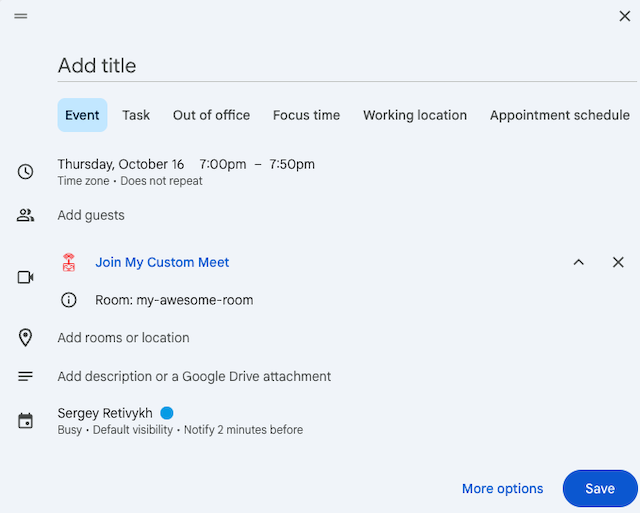

# Google Calendar Addons for Jitsi Meet Self Hosted

- [google-calendar](./google-calendar/README.md) - addon for google workspace. With it you can create room links for meeting in calendar
- [room-name-changer](./room-name-changer/README.md) - mini-service for changing room names, was created by google-calendar addon

