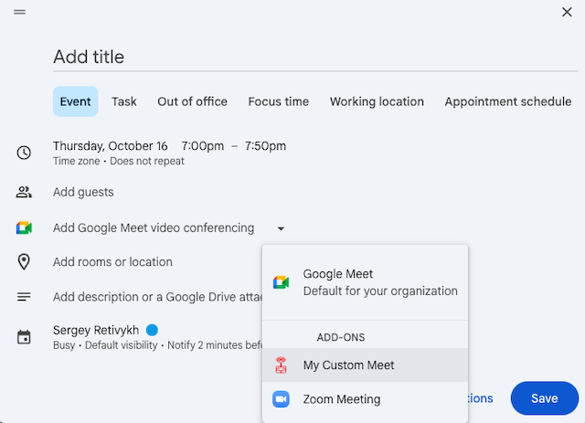

# Plugin for Google Calendar Video Conference Creation

This project is intended for integration with Google Workspace and adds the ability for all employees to create video conferences directly from a Calendar event.

By "creating a conference" we mean generating a valid meeting link that, when opened, performs all the necessary actions to join the meeting.

The meeting name is generated randomly with simple template. Feel free to set any template, but generated. It's more simplier to change room name from another interface rather from calendar.

## Deployment

### Setup App Scripts

1. Create a new project in Google Apps Script: https://script.google.com/home/
2. Enable manifest editing (so `appsscript.json` is visible) and copy the manifest data from this repository into it. Set logoUrl empty now.
3. Create the remaining `.gs` files and paste the code from the repository.
4. If the Calendar integration does not appear automatically from the manifest, add the Calendar service integration manually in the script settings.
5. Set MEET_DOMAIN script property in settings.
6. Start deployment -> Test deployment.

This should be enough for your account to see an additional Add-on entry when creating a Calendar event. Note: there won't be an icon by default.
If there's an error in Calendar, you can read the logs under "Executions" in Apps Scpipt IDE section and select the appropriate deployment.

After testing, create a New deployment. I recommend making subsequent code changes using "Manage deployments" and updating the current deployment.
Here you can see deployment ID, we will use it later.

### Setup Marketplace Addon

Next, we need to publish the app so the admin can add it to the workspace and make it available to everyone.

1. Create a new project in Google Cloud: https://console.cloud.google.com/projectcreate
2. Fill in the required information and copy the Project ID.
3. Link your Apps Script project to the Cloud project explicitly: Apps Script settings -> Google Cloud Platform (GCP) Project -> Change project and enter the Project ID.
4. Enable API: Google Calendar API.
5. Enable API: Google Workspace Marketplace SDK.
6. In the Marketplace SDK configure the Store Listing, including uploading icon assets and screenshots.
7. You can then use the icon URL as `logoUrl` in `appsscript.json`.
8. In the Marketplace SDK edit App configuration: set Private Visibility, choose Google Workspace add-on, provide the Deployment ID from your Apps Script, and copy the scopes from the Apps Script manifest.
9. Publish. You should be able to find your Add-on on https://workspace.google.com/marketplace.
10. Send the Marketplace link to your Workspace admin and wait for them to install it.